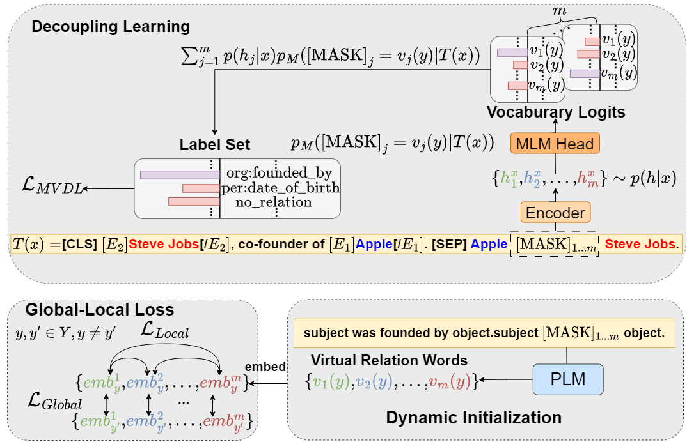

# MVRE

Code for the AAAI 2024 long paper "[Improving Low-resource Prompt-based Relation Representation with Multi-view Decoupling Learning](https://arxiv.org/pdf/2312.17267.pdf)"


# Model Architecture

<div align=center>

</div>

The inference procedure of our RetrievalRE.


# Requirements

To install requirements:

```
pip install -r requirements.txt
```

# How to run

## Initialize the answer words

Use the comand below to get the answer words to use in the training.

```shell
python get_label_word.py --model_name_or_path bert-large-uncased  --dataset_name semeval
```

The `{answer_words}.pt`will be saved in the dataset, you need to assign the `model_name_or_path` and `dataset_name` in the `get_label_word.py`.

## Split few-shot dataset

Download the data first, and put it to `dataset` folder. Run the comand below, and get the few shot dataset.

```shell
python generate_k_shot.py --data_dir ./dataset --k 8 --dataset semeval
cd dataset
cd semeval
cp rel2id.json val.txt test.txt ./k-shot/8-1
```
You need to modify the `k` and `dataset` to assign k-shot and dataset. Here we default seed as 1,2,3,4,5 to split each k-shot, you can revise it in the `generate_k_shot.py`

## Run
```bash
bash scripts/semeval.sh 
bash scripts/tacred.sh
bash scripts/tacrev.sh
```

# Acknowledgement

Part of our code is borrowed from code of [RetrievalRE](https://github.com/zjunlp/PromptKG/tree/main/research/RetrievalRE), many thanks.

# Papers for the Project & How to Cite
If you use or extend our work, please cite the paper as follows:

```bibtex
@misc{fan2024improving,
      title={Improving Low-resource Prompt-based Relation Representation with Multi-view Decoupling Learning}, 
      author={Chenghao Fan and Wei Wei and Xiaoye Qu and Zhenyi Lu and Wenfeng Xie and Yu Cheng and Dangyang Chen},
      year={2024},
      eprint={2312.17267},
      archivePrefix={arXiv},
      primaryClass={cs.CL}
}
```

or

```bibtex
@article{Fan_Wei_Qu_Lu_Xie_Cheng_Chen_2024,
      title={Enhancing Low-Resource Relation Representations through Multi-View Decoupling}, 
      volume={38}, url={https://ojs.aaai.org/index.php/AAAI/article/view/29752}, 
      DOI={10.1609/aaai.v38i16.29752}, 
      abstractNote={Recently, prompt-tuning with pre-trained language models (PLMs) has demonstrated the significantly enhancing ability of relation extraction (RE) tasks. However, in low-resource scenarios, where the available training data is scarce, previous prompt-based methods may still perform poorly for prompt-based representation learning due to a superficial understanding of the relation. To this end, we highlight the importance of learning high-quality relation representation in low-resource scenarios for RE, and propose a novel prompt-based relation representation method, named MVRE (Multi-View Relation Extraction), to better leverage the capacity of PLMs to improve the performance of RE within the low-resource prompt-tuning paradigm. Specifically, MVRE decouples each relation into different perspectives to encompass multi-view relation representations for maximizing the likelihood during relation inference.
Furthermore, we also design a Global-Local loss and a Dynamic-Initialization method for better alignment of the multi-view relation-representing virtual words, containing the semantics of relation labels during the optimization learning process and initialization. Extensive experiments on
three benchmark datasets show that our method can achieve
state-of-the-art in low-resource settings.}, 
      number={16}, 
      journal={Proceedings of the AAAI Conference on Artificial Intelligence}, 
      author={Fan, Chenghao and Wei, Wei and Qu, Xiaoye and Lu, Zhenyi and Xie, Wenfeng and Cheng, Yu and Chen, Dangyang}, year={2024}, month={Mar.}, pages={17968-17976}
}
```
